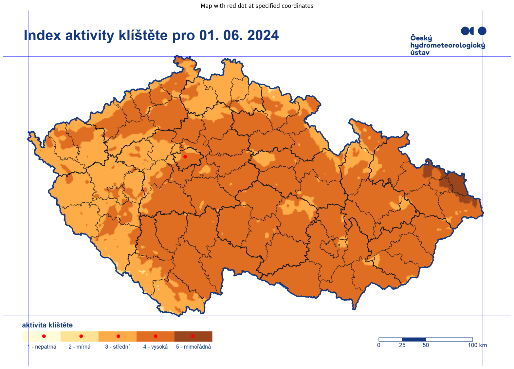

# CHMÚ API
- This repository contains API for Český hydrometeorologický ústav (CHMU) since they don't have a public one. 
> [!IMPORTANT]
> Current version only provides access to tick (klíště) activity for the current day.

# Motivation
I had a pretty nasty tick (klíště) on my foot and since we've already had a boreliosis case in my family we're extra cautious. I always knew that CHMU publishes these nice maps that show for example the tick activity for a given day but you'd always have to lookup a map and look at it.

I don't consider "manually looking on a map and figuring out colors" a viable approach for the modern data driven world. Let Python do it for you...

# Usage
- I'm going to make a public rate-limited API so that this piece of code is usable. 
- In the future this will be integrated with Homeassistant.
- Use calibration.ipynb to calibrate the code according to your needs.

# Explanation
- The code is able to transform real world coordinates within the borders of the Czech republic to a CHMU map.
- It will then recognize the map color at given coordinates and match it to the severity. 
- Then it will return the severity value and description as a dict.

